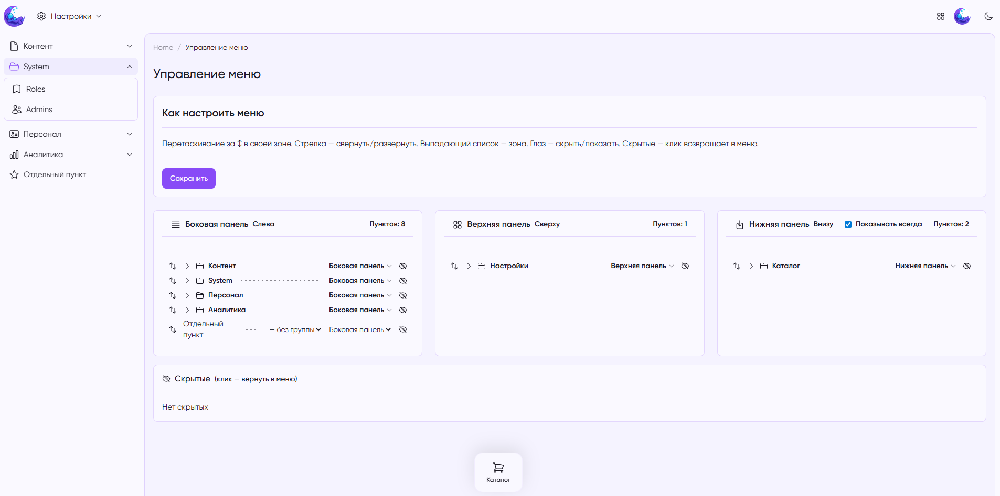

# MoonShine Menu Manager

Drag-and-drop menu manager for [MoonShine 4.x](https://moonshine-laravel.com/) admin panel. Organize menu items across multiple zones (sidebar, topbar, bottom bar), reorder groups and standalone items, toggle visibility — all from a visual interface.


## Features

- **Multi-zone layout** — distribute menu items across sidebar, topbar, and bottom bar
- **Drag-and-drop** — reorder groups and individual items (including nested items within groups)
- **Visibility toggle** — hide/show individual items or entire groups
- **Per-user configuration** — optionally save menu layout per MoonShine user
- **Bottom bar controls** — "always visible" toggle for the bottom bar zone
- **Dark mode** — full support for MoonShine's dark theme
- **Responsive** — works on mobile devices

## Requirements

- PHP 8.2+
- Laravel 11+
- MoonShine 4.x

## Installation

```bash
composer require goodappr/moonshine-menu-manager
```

### Run migrations

```bash
php artisan migrate
```

This creates two tables:
- `menu_item_configs` — stores item positions, zones, visibility, and parent relationships
- `menu_zone_settings` — stores per-zone settings (e.g. bottom bar "always visible")

### Publish configuration (optional)

```bash
php artisan vendor:publish --tag=moonshine-menu-manager-config
```

This publishes `config/moonshine_menu_manager.php`:

```php
return [
    // Enable/disable the menu manager globally
    'enabled' => true,

    // Available zones
    'zones' => ['sidebar', 'topbar', 'bottom_bar'],

    // Default active zones for layouts without saved config
    'default_layout_zones' => ['sidebar', 'topbar', 'bottom_bar'],

    // Layout-specific overrides (reserved for future use)
    'layouts' => [],

    // Save menu configuration per MoonShine user
    'per_user' => false,
];
```

## Setup

### 1. Add the trait to your layout

In your MoonShine layout class (e.g. `app/MoonShine/Layouts/MoonShineLayout.php`), add the `CustomMenuManager` trait:

```php
<?php

declare(strict_types=1);

namespace App\MoonShine\Layouts;

use MoonShine\CustomMenuManager\Traits\CustomMenuManager;
use MoonShine\Laravel\Layouts\AppLayout;

final class MoonShineLayout extends AppLayout
{
    use CustomMenuManager;

    // The trait overrides build(), getSidebarComponent(), getTopBarComponent(),
    // getBottomBarComponent(), and getHeaderComponent() to support multi-zone menus.
}
```

The package auto-registers the menu manager page. A gear/grid icon appears in the sidebar — clicking it opens the manager.

### 2. Clear caches after installation

```bash
php artisan config:clear
php artisan view:clear
php artisan cache:clear
```

### Example



## Usage

### Managing menu items

1. Navigate to the menu manager page (click the grid icon in the sidebar)
2. **Reorder** — drag items by the ↕ handle within a zone
3. **Move between zones** — use the zone dropdown on each item or group
4. **Group management** — use the group dropdown to move items between groups
5. **Visibility** — click the eye icon to hide/show items or groups
6. **Save** — click "Сохранить" to persist changes

### How it works

The package discovers all menu items registered in your MoonShine application via the `MenuManagerContract`. It flattens the menu tree and allows you to:

- Reassign items to different zones (sidebar → topbar, etc.)
- Reorder items within zones
- Move items between groups or make them standalone
- Hide items from the rendered menu

Configuration is stored in the database and loaded on every request via the `MenuConfigService`.

### Per-user menus

Set `per_user` to `true` in the config file to allow each MoonShine user to have their own menu layout:

```php
// config/moonshine_menu_manager.php
'per_user' => true,
```

When enabled, menu configurations are scoped to the authenticated MoonShine user. When no user-specific config exists, the default menu is shown.

## Architecture

```
moonshine-menu-manager/
├── config/moonshine_menu_manager.php
├── database/migrations/
├── resources/
│   ├── css/  js/
│   └── views/
├── src/
│   ├── Components/  Models/  Pages/
│   ├── Providers/  Services/  Traits/
├── images/
├── composer.json
├── LICENSE
└── README.md
```

### Key classes

| Class | Responsibility |
|---|---|
| `MenuDiscoveryService` | Discovers all menu items/groups from MoonShine's MenuManager |
| `MenuConfigService` | Loads/saves menu configuration from the database |
| `MenuManagerPage` | Admin page with the visual menu editor |
| `MenuManagerComponent` | MoonShine component that renders the editor UI |
| `CustomMenuManager` | Trait that integrates the manager into your layout |

## License

MIT License. See [LICENSE](LICENSE) for details.

